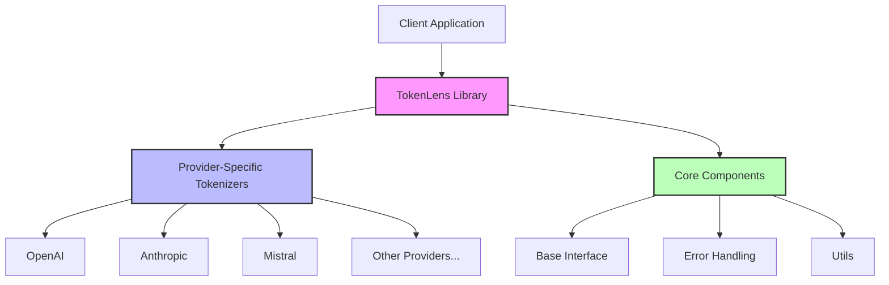
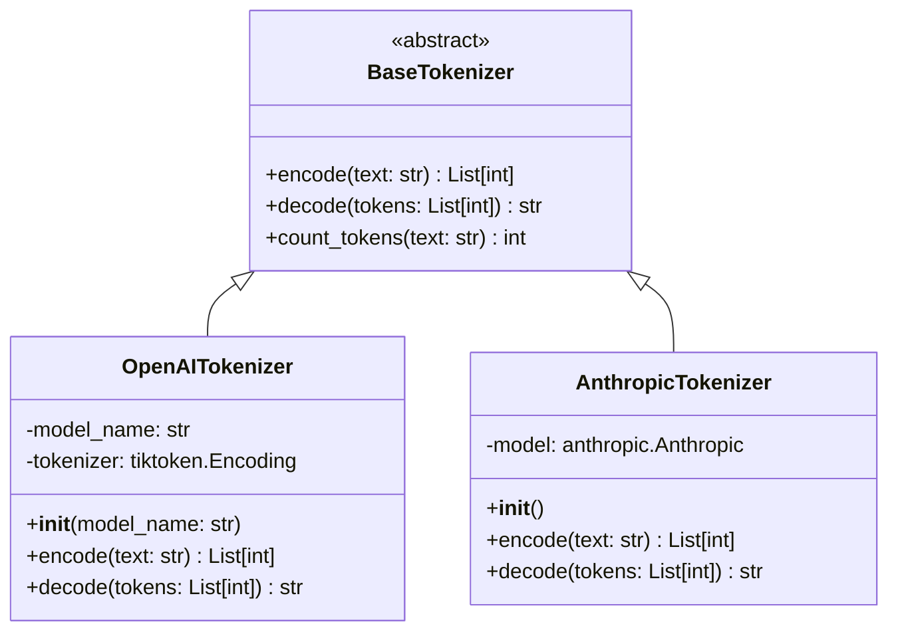
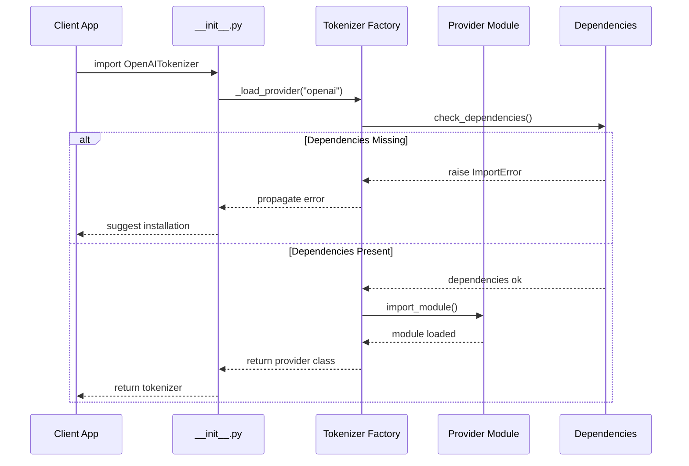
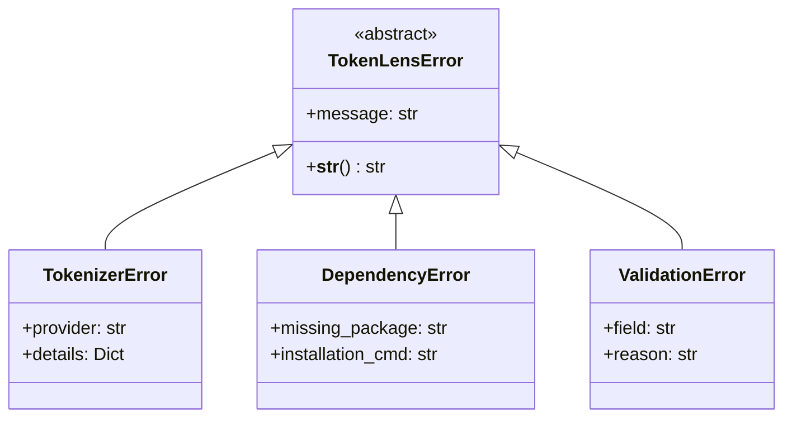
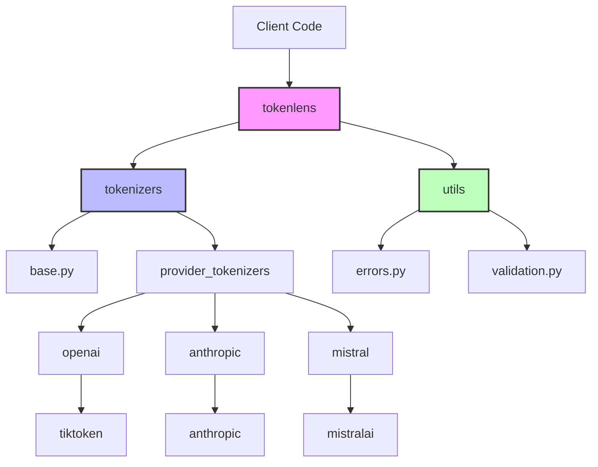
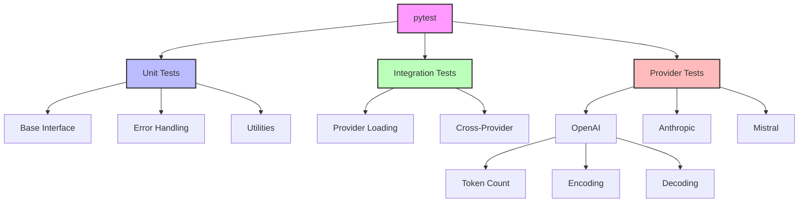

# TokenLens Architecture

This document outlines the architectural design of the TokenLens library, which provides a unified interface for token counting and limit management across various LLM providers.

## High-Level Architecture



### Key Components

1. **Client Layer**
   - User applications that need token counting
   - Imports specific tokenizers as needed
   - Handles provider-specific configurations

2. **TokenLens Core**
   - Provides unified tokenizer interface
   - Manages lazy loading of providers
   - Handles error propagation

3. **Provider Layer**
   - Provider-specific implementations
   - Encapsulates provider dependencies
   - Implements token counting logic

## Detailed Component Design

### 1. Tokenizer System



### 2. Provider Loading System



### 3. Error Handling System



## Implementation Details

### 1. Lazy Loading Implementation

```python
# tokenlens/__init__.py
from typing import Dict, Type
from importlib import import_module
from .tokenizers.base import BaseTokenizer

class TokenizerLoader:
    _cache: Dict[str, Type[BaseTokenizer]] = {}
    
    @classmethod
    def get_tokenizer(cls, provider: str) -> Type[BaseTokenizer]:
        if provider not in cls._cache:
            module = import_module(f".{provider}_tokenizer", "tokenlens.tokenizers")
            cls._cache[provider] = getattr(module, f"{provider.capitalize()}Tokenizer")
        return cls._cache[provider]

# Usage
OpenAITokenizer = TokenizerLoader.get_tokenizer("openai")
```

### 2. Provider Implementation Example

```python
# tokenlens/tokenizers/openai_tokenizer.py
import tiktoken
from typing import List
from .base import BaseTokenizer

class OpenAITokenizer(BaseTokenizer):
    def __init__(self, model_name: str = "gpt-4"):
        try:
            self.tokenizer = tiktoken.encoding_for_model(model_name)
            self.model_name = model_name
            self.model_max_tokens = self._get_model_max_tokens()
        except Exception as e:
            raise TokenizerError(f"Failed to initialize OpenAI tokenizer: {str(e)}")
    
    def _get_model_max_tokens(self) -> int:
        limits = {
            "gpt-4": 8192,
            "gpt-4-32k": 32768,
            "gpt-3.5-turbo": 4096
        }
        return limits.get(self.model_name, 4096)
    
    def encode(self, text: str) -> List[int]:
        try:
            return self.tokenizer.encode(text)
        except Exception as e:
            raise TokenizerError(f"Encoding failed: {str(e)}")
    
    def decode(self, tokens: List[int]) -> str:
        try:
            return self.tokenizer.decode(tokens)
        except Exception as e:
            raise TokenizerError(f"Decoding failed: {str(e)}")
```

### 3. Complete Data Flow

```ascii
┌──────────────────┐
│   Client Code    │
└────────┬─────────┘
         │
         ▼
┌──────────────────┐     ┌─────────────────┐
│ Import Tokenizer │────>│  Lazy Loading   │
└────────┬─────────┘     └────────┬────────┘
         │                        │
         ▼                        ▼
┌──────────────────┐     ┌─────────────────┐
│    Initialize    │<────│   Load Module   │
└────────┬─────────┘     └─────────────────┘
         │
         ▼
┌──────────────────┐     ┌─────────────────┐
│  Process Text    │────>│ Validate Input  │
└────────┬─────────┘     └────────┬────────┘
         │                        │
         ▼                        ▼
┌──────────────────┐     ┌─────────────────┐
│ Provider API     │<────│  Error Handler  │
└────────┬─────────┘     └─────────────────┘
         │
         ▼
┌──────────────────┐
│  Return Result   │
└──────────────────┘
```

### 4. Module Dependencies



## Testing Architecture

### 1. Test Structure

```ascii
tests/
├── __init__.py
├── conftest.py           # Shared fixtures
├── unit/
│   ├── __init__.py
│   ├── test_base.py     # Base interface tests
│   ├── test_errors.py   # Error handling tests
│   └── test_utils.py    # Utility function tests
├── integration/
│   ├── __init__.py
│   └── test_loading.py  # Provider loading tests
└── providers/
    ├── __init__.py
    ├── test_openai.py   # OpenAI-specific tests
    ├── test_anthropic.py
    └── test_mistral.py
```

### 2. Test Flow



## Common Usage Patterns

### 1. Basic Token Counting

```python
from tokenlens import OpenAITokenizer

def process_text(text: str, max_tokens: int = 4096) -> bool:
    tokenizer = OpenAITokenizer(model_name="gpt-4")
    count = tokenizer.count_tokens(text)
    return count <= max_tokens
```

### 2. Error Handling Pattern

```python
from tokenlens import OpenAITokenizer, TokenizerError

def safe_token_count(text: str) -> int:
    try:
        tokenizer = OpenAITokenizer()
        return tokenizer.count_tokens(text)
    except TokenizerError as e:
        logger.error(f"Token counting failed: {str(e)}")
        raise
    except Exception as e:
        logger.error(f"Unexpected error: {str(e)}")
        raise TokenizerError(f"Unexpected error during token counting: {str(e)}")
```

### 3. Provider Selection Pattern

```python
from tokenlens import BaseTokenizer, OpenAITokenizer, AnthropicTokenizer

def get_tokenizer(provider: str) -> BaseTokenizer:
    tokenizers = {
        "openai": OpenAITokenizer,
        "anthropic": AnthropicTokenizer,
    }
    if provider not in tokenizers:
        raise ValueError(f"Unsupported provider: {provider}")
    return tokenizers[provider]()

```

## Token Counting Without TokenLens

### OpenAI

```python
# Using tiktoken directly
import tiktoken

def count_openai_tokens(text: str, model: str = "gpt-4") -> int:
    try:
        encoding = tiktoken.encoding_for_model(model)
        return len(encoding.encode(text))
    except Exception as e:
        print(f"Error counting tokens: {str(e)}")
        return 0

# Example usage
text = "Hello, world!"
token_count = count_openai_tokens(text, "gpt-4")
```

### Anthropic

```python
# Using anthropic's built-in tokenizer
from anthropic import Anthropic

def count_anthropic_tokens(text: str) -> int:
    try:
        client = Anthropic()
        return client.count_tokens(text)
    except Exception as e:
        print(f"Error counting tokens: {str(e)}")
        return 0

# Example usage
text = "Hello, world!"
token_count = count_anthropic_tokens(text)
```

### Mistral

```python
# Using mistralai's tokenizer
from mistralai.client import MistralClient
from mistralai.models.chat_completion import ChatMessage

def count_mistral_tokens(text: str, api_key: str) -> int:
    try:
        client = MistralClient(api_key=api_key)
        messages = [ChatMessage(role="user", content=text)]
        return client.count_tokens(messages)
    except Exception as e:
        print(f"Error counting tokens: {str(e)}")
        return 0

# Example usage
text = "Hello, world!"
token_count = count_mistral_tokens(text, "your-api-key")
```

### Cohere

```python
# Using cohere's API
import cohere

def count_cohere_tokens(text: str, api_key: str) -> int:
    try:
        co = cohere.Client(api_key)
        return co.tokenize(text=text).length
    except Exception as e:
        print(f"Error counting tokens: {str(e)}")
        return 0

# Example usage
text = "Hello, world!"
token_count = count_cohere_tokens(text, "your-api-key")
```

### Meta (LLaMA)

```python
# Using transformers library
from transformers import AutoTokenizer

def count_llama_tokens(text: str, model_name: str = "meta-llama/Llama-2-7b-chat-hf") -> int:
    try:
        tokenizer = AutoTokenizer.from_pretrained(model_name)
        return len(tokenizer.encode(text))
    except Exception as e:
        print(f"Error counting tokens: {str(e)}")
        return 0

# Example usage
text = "Hello, world!"
token_count = count_llama_tokens(text)
```

### HuggingFace

```python
# Using transformers library
from transformers import AutoTokenizer

def count_hf_tokens(text: str, model_name: str) -> int:
    try:
        tokenizer = AutoTokenizer.from_pretrained(model_name)
        return len(tokenizer.encode(text))
    except Exception as e:
        print(f"Error counting tokens: {str(e)}")
        return 0

# Example usage
text = "Hello, world!"
token_count = count_hf_tokens(text, "gpt2")
```

### Google PaLM

```python
# Using google.generativeai
import google.generativeai as palm

def count_palm_tokens(text: str, api_key: str) -> int:
    try:
        palm.configure(api_key=api_key)
        # Note: PaLM doesn't provide direct token counting
        # This is an approximation based on their documentation
        return len(text.split()) * 1.3  # Rough estimate
    except Exception as e:
        print(f"Error counting tokens: {str(e)}")
        return 0

# Example usage
text = "Hello, world!"
token_count = count_palm_tokens(text, "your-api-key")
```

### AI21

```python
# Using AI21 Studio
import ai21

def count_ai21_tokens(text: str, api_key: str) -> int:
    try:
        ai21.api_key = api_key
        response = ai21.TokenizeText(
            text=text
        )
        return len(response['tokens'])
    except Exception as e:
        print(f"Error counting tokens: {str(e)}")
        return 0

# Example usage
text = "Hello, world!"
token_count = count_ai21_tokens(text, "your-api-key")
```

### Qwen

```python
# Using transformers library
from transformers import AutoTokenizer

def count_qwen_tokens(text: str) -> int:
    try:
        tokenizer = AutoTokenizer.from_pretrained("Qwen/Qwen-7B-Chat")
        return len(tokenizer.encode(text))
    except Exception as e:
        print(f"Error counting tokens: {str(e)}")
        return 0

# Example usage
text = "Hello, world!"
token_count = count_qwen_tokens(text)
```

### DeepMind (Gemini)

```python
# Using google.generativeai for Gemini
import google.generativeai as genai

def count_gemini_tokens(text: str, api_key: str) -> int:
    try:
        genai.configure(api_key=api_key)
        model = genai.GenerativeModel('gemini-pro')
        # Note: Gemini doesn't provide direct token counting
        # This is an approximation
        return len(text.split()) * 1.5  # Rough estimate
    except Exception as e:
        print(f"Error counting tokens: {str(e)}")
        return 0

# Example usage
text = "Hello, world!"
token_count = count_gemini_tokens(text, "your-api-key")
```

### Stanford (Alpaca)

```python
# Using transformers for Alpaca
from transformers import AutoTokenizer

def count_alpaca_tokens(text: str) -> int:
    try:
        tokenizer = AutoTokenizer.from_pretrained("tatsu-lab/alpaca-7b")
        return len(tokenizer.encode(text))
    except Exception as e:
        print(f"Error counting tokens: {str(e)}")
        return 0

# Example usage
text = "Hello, world!"
token_count = count_alpaca_tokens(text)
```

### Challenges Without TokenLens

1. **Multiple Dependencies**
   - Need to install and manage multiple tokenizer libraries
   - Each provider requires different setup and configuration
   - Version compatibility issues between packages

2. **Inconsistent APIs**
   - Different methods for token counting (`encode()`, `count_tokens()`, `tokenize()`)
   - Varying parameter names and structures
   - Inconsistent error handling

3. **Resource Management**
   - Loading multiple tokenizers consumes memory
   - No caching or resource sharing between calls
   - Potential performance issues with repeated initialization

4. **Error Handling**
   - Each provider has its own error types
   - Need to handle API-specific exceptions
   - Inconsistent error messages and recovery

5. **Maintenance Burden**
   - Need to update multiple dependencies
   - Keep track of API changes for each provider
   - Handle breaking changes separately

6. **Code Duplication**
   - Similar boilerplate code for each provider
   - Duplicate error handling and validation
   - Redundant utility functions

### Benefits of TokenLens

1. **Unified Interface**
   - Single API for all providers
   - Consistent method names and parameters
   - Standardized error handling

2. **Resource Optimization**
   - Lazy loading of dependencies
   - Shared tokenizer instances
   - Efficient memory usage

3. **Maintainability**
   - Centralized updates and fixes
   - Version compatibility management
   - Consistent error handling

4. **Developer Experience**
   - Reduced boilerplate code
   - Clear documentation
   - Type hints and IDE support

### Cost of Implementation

1. **Development Time**
```python
# Without TokenLens - Need separate implementations
def count_tokens(text: str, provider: str) -> int:
    if provider == "openai":
        return count_openai_tokens(text)
    elif provider == "anthropic":
        return count_anthropic_tokens(text)
    elif provider == "mistral":
        return count_mistral_tokens(text)
    # ... and so on for each provider
    else:
        raise ValueError(f"Unsupported provider: {provider}")

# With TokenLens - Single unified interface
from tokenlens import get_tokenizer

def count_tokens(text: str, provider: str) -> int:
    tokenizer = get_tokenizer(provider)
    return tokenizer.count_tokens(text)
```

2. **Maintenance Effort**
```python
# Without TokenLens - Need to update each implementation
def update_model_limits():
    openai_limits = {
        "gpt-4": 8192,
        "gpt-4-32k": 32768,
        # ... need to maintain for each model
    }
    anthropic_limits = {
        "claude-2": 100000,
        # ... need to maintain separately
    }
    # ... and so on for each provider

# With TokenLens - Centralized updates
from tokenlens import get_model_limits

limits = get_model_limits()  # All providers updated centrally
```

3. **Error Handling Complexity**
```python
# Without TokenLens - Complex error handling
def safe_count_tokens(text: str, provider: str) -> int:
    try:
        if provider == "openai":
            import tiktoken
            try:
                encoding = tiktoken.encoding_for_model("gpt-4")
                return len(encoding.encode(text))
            except Exception as e:
                raise ValueError(f"OpenAI token counting failed: {str(e)}")
        elif provider == "anthropic":
            from anthropic import Anthropic
            try:
                client = Anthropic()
                return client.count_tokens(text)
            except Exception as e:
                raise ValueError(f"Anthropic token counting failed: {str(e)}")
        # ... repeat for each provider
    except ImportError as e:
        raise ImportError(f"Required package for {provider} not installed: {str(e)}")
    except Exception as e:
        raise RuntimeError(f"Unexpected error: {str(e)}")

# With TokenLens - Unified error handling
from tokenlens import get_tokenizer, TokenLensError

def safe_count_tokens(text: str, provider: str) -> int:
    try:
        tokenizer = get_tokenizer(provider)
        return tokenizer.count_tokens(text)
    except TokenLensError as e:
        # Single error handling path
        raise

```

### Performance Comparison

```python
import time

def benchmark_token_counting():
    text = "Sample text for benchmarking" * 1000
    
    # Without TokenLens
    start = time.time()
    providers = ["openai", "anthropic", "cohere", "mistral"]
    results_manual = {}
    
    for provider in providers:
        if provider == "openai":
            tokenizer = tiktoken.encoding_for_model("gpt-4")
            results_manual[provider] = len(tokenizer.encode(text))
        elif provider == "anthropic":
            client = Anthropic()
            results_manual[provider] = client.count_tokens(text)
        # ... more providers
    
    time_manual = time.time() - start
    
    # With TokenLens
    start = time.time()
    results_tokenlens = {
        provider: get_tokenizer(provider).count_tokens(text)
        for provider in providers
    }
    time_tokenlens = time.time() - start
    
    return {
        "manual_time": time_manual,
        "tokenlens_time": time_tokenlens,
        "speedup": time_manual / time_tokenlens
    }
```

### Memory Usage Comparison

```python
import psutil
import os

def measure_memory_usage():
    process = psutil.Process(os.getpid())
    
    # Without TokenLens
    base_memory = process.memory_info().rss
    tokenizers = {
        "openai": tiktoken.encoding_for_model("gpt-4"),
        "hf": AutoTokenizer.from_pretrained("gpt2"),
        "anthropic": Anthropic(),
        "cohere": cohere.Client("api-key")
    }
    manual_memory = process.memory_info().rss - base_memory
    
    # Clear memory
    del tokenizers
    
    # With TokenLens
    base_memory = process.memory_info().rss
    tokenizer_manager = TokenizerManager()
    tokenlens_memory = process.memory_info().rss - base_memory
    
    return {
        "manual_memory_mb": manual_memory / (1024 * 1024),
        "tokenlens_memory_mb": tokenlens_memory / (1024 * 1024),
        "memory_savings": (manual_memory - tokenlens_memory) / manual_memory * 100
    }
```

### API Inconsistencies

Without TokenLens:
```python
# Different ways to count tokens across providers
def count_tokens_across_providers(text: str) -> dict:
    results = {}
    
    # OpenAI - uses encode()
    encoding = tiktoken.encoding_for_model("gpt-4")
    results["openai"] = len(encoding.encode(text))
    
    # Anthropic - uses count_tokens()
    anthropic = Anthropic()
    results["anthropic"] = anthropic.count_tokens(text)
    
    # Cohere - uses tokenize().length
    co = cohere.Client("api-key")
    results["cohere"] = co.tokenize(text=text).length
    
    # HuggingFace - uses encode()
    hf_tokenizer = AutoTokenizer.from_pretrained("gpt2")
    results["huggingface"] = len(hf_tokenizer.encode(text))
    
    return results
```

With TokenLens:
```python
from tokenlens import get_tokenizer

def count_tokens_across_providers(text: str) -> dict:
    providers = ["openai", "anthropic", "cohere", "huggingface"]
    return {
        provider: get_tokenizer(provider).count_tokens(text)
        for provider in providers
    }
```

### Resource Management Challenges

Without TokenLens:
```python
# Memory-intensive way without proper resource management
class TokenCounter:
    def __init__(self):
        # Load all tokenizers upfront - wasteful
        self.openai = tiktoken.encoding_for_model("gpt-4")
        self.hf_tokenizer = AutoTokenizer.from_pretrained("gpt2")
        self.anthropic = Anthropic()
        self.cohere = cohere.Client("api-key")
        # ... more initializations
    
    def count(self, text: str, provider: str) -> int:
        if provider == "openai":
            return len(self.openai.encode(text))
        elif provider == "huggingface":
            return len(self.hf_tokenizer.encode(text))
        # ... more conditions
```

With TokenLens:
```python
from tokenlens import TokenizerManager

# Efficient resource management
manager = TokenizerManager()
tokenizer = manager.get_tokenizer("openai")  # Lazy loading
count = tokenizer.count_tokens(text)
```

### Version Compatibility

Without TokenLens:
```python
# Need to handle version compatibility manually
def initialize_openai_tokenizer():
    try:
        import openai
        if openai.__version__ >= "1.0.0":
            # New API style
            from openai import OpenAI
            client = OpenAI()
        else:
            # Old API style
            import openai as client
        return client
    except ImportError:
        raise ImportError("OpenAI package not found")
```

With TokenLens:
```python
from tokenlens import get_tokenizer

# Version compatibility handled internally
tokenizer = get_tokenizer("openai")  # Works across versions
```

### Model-Specific Token Limits

Without TokenLens:
```python
# Manual management of model limits
MODEL_LIMITS = {
    "openai": {
        "gpt-4": 8192,
        "gpt-4-32k": 32768,
        "gpt-3.5-turbo": 4096
    },
    "anthropic": {
        "claude-2": 100000,
        "claude-instant": 100000
    },
    "mistral": {
        "mistral-tiny": 8192,
        "mistral-small": 32768
    },
    "cohere": {
        "command": 4096,
        "command-light": 4096
    }
}

def validate_token_count(text: str, provider: str, model: str) -> bool:
    count = count_tokens(text, provider)
    if provider not in MODEL_LIMITS:
        raise ValueError(f"Unknown provider: {provider}")
    if model not in MODEL_LIMITS[provider]:
        raise ValueError(f"Unknown model: {model}")
    return count <= MODEL_LIMITS[provider][model]
```

With TokenLens:
```python
from tokenlens import get_tokenizer

tokenizer = get_tokenizer("openai", model="gpt-4")
is_valid = tokenizer.validate_token_count(text)  # Automatic limit checking
```

### Error Recovery Strategies

Without TokenLens:
```python
def robust_token_counting(text: str, provider: str) -> int:
    max_retries = 3
    retry_count = 0
    
    while retry_count < max_retries:
        try:
            if provider == "openai":
                return count_openai_tokens(text)
            elif provider == "anthropic":
                return count_anthropic_tokens(text)
            # ... more providers
        except ConnectionError:
            retry_count += 1
            time.sleep(1)  # Basic backoff
        except RateLimitError:
            time.sleep(5)  # Wait for rate limit
            retry_count += 1
        except Exception as e:
            logger.error(f"Unhandled error: {str(e)}")
            return 0
    
    raise RuntimeError("Max retries exceeded")
```

With TokenLens:
```python
from tokenlens import get_tokenizer, RetryConfig

config = RetryConfig(max_retries=3, backoff_factor=1.0)
tokenizer = get_tokenizer("openai", retry_config=config)
count = tokenizer.count_tokens(text)  # Built-in retry handling
